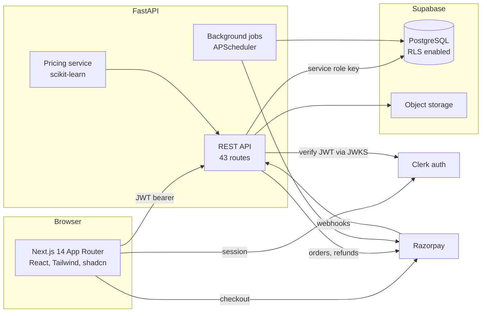
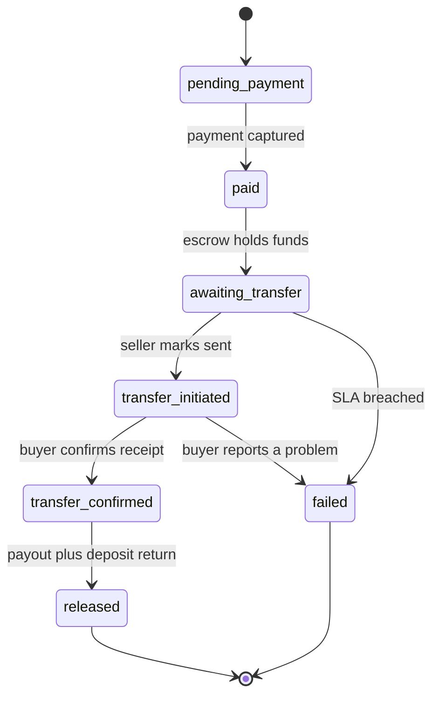
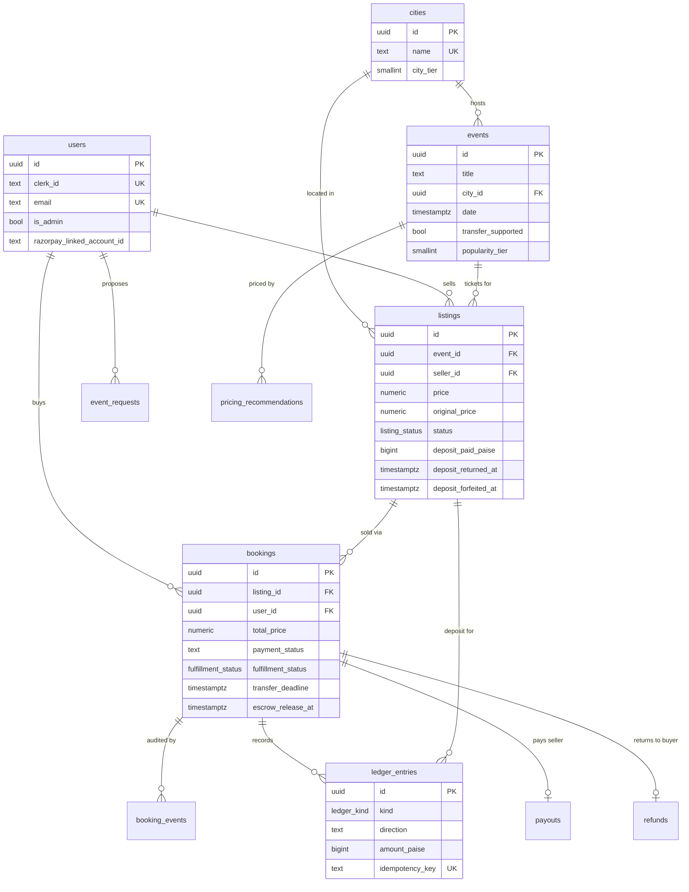

# TicketVault

A concert ticket resale marketplace where the buyer's money is held in escrow,
the seller puts down a refundable deposit before they can list, and the ticket
moves through the issuer's own transfer feature rather than as a screenshot.

Built as a final year project. Frontend in Next.js, backend in FastAPI,
Postgres via Supabase, with a trained pricing model serving live price guidance.

---

## The problem

Concert ticket resale in India happens mostly in WhatsApp groups and Instagram
DMs. Someone pays first and hopes. The common frauds are not sophisticated:

1. The seller takes the money and disappears.
2. The seller sends a **screenshot of a QR code** and sells the same ticket to
   four other people. Everyone has a valid looking image. One person gets in.

The second one is the interesting problem, because it is not solved by escrow,
reviews, or a dispute process. **A screenshot is a copy.** Any system built on
sending an image of a ticket can be defrauded by sending that image twice, and
no amount of verification at the platform level changes that. The fraud is only
discovered at the venue gate, hours after everyone involved has stopped paying
attention.

## The idea

TicketVault does not move ticket images. It coordinates a **transfer inside
BookMyShow or District**, the apps that issued the ticket in the first place.

That matters because an issuer side transfer is **single use and
irreversible**. When the buyer accepts, the seller permanently loses access.
There is no copy left to sell to anyone else. The double spend problem is not
mitigated, it is structurally eliminated, because the ticket is a single object
that moved rather than a file that was duplicated.

Three mechanisms follow from that:

| | |
|---|---|
| **Escrow** | The buyer pays TicketVault, not the seller. The money is held until the buyer confirms the ticket landed in their account. |
| **Seller deposit** | Every seller pays a refundable deposit before their listing goes live. Deliver, and it comes back in full alongside the sale proceeds. Fail, and it is forfeited: the buyer is refunded **and** compensated out of it. |
| **Issuer transfer** | The ticket moves through BookMyShow or District. The seller loses their copy. |

The deposit is the part worth arguing about, and it is the answer to a question
most marketplace projects cannot answer: **who actually pays when it goes
wrong?** Not the platform out of goodwill, and not the buyer. The party who
broke the deal, out of money they had already put at risk.

---

## Architecture



Two things about this diagram are deliberate.

**The browser never talks to Postgres.** Supabase row level security is on with
no public policies, so the anon key shipped to the browser can read nothing.
Every read and write goes through FastAPI, which is where authorisation
actually lives. The service role key never leaves the backend.

**Razorpay webhooks point back at the API.** Client side payment confirmation is
advisory. The webhook is what the system treats as authoritative, so a user
closing their laptop mid checkout cannot leave a payment unrecorded.

---

## The booking lifecycle

Every state change goes through one service module with explicit allowed
transitions, and every transition writes an audit row to `booking_events`. No
route mutates a booking's status directly.



The two terminal states are where the money settles:

**`released`** fires `SETTLEMENT_HOLD_HOURS` after the buyer confirms. The
seller receives the sale proceeds and their deposit back, in one operation.

**`failed`** fires when the seller misses the transfer deadline. The buyer is
refunded in full and paid compensation from the forfeited deposit. Nobody has to
file a complaint. The most common failure resolves itself.

### Why release runs from confirmation, not from the event

An earlier design held escrow until 24 hours after the event, on the reasoning
that a fake ticket only reveals itself at the gate. That is correct **for the
screenshot model**. Under the transfer model the ticket is sitting in the
buyer's own ticketing account, placed there by the issuer, so the issuer has
already validated what escrow was waiting to find out. Holding an honest
seller's money for weeks past that point buys no additional safety.

`SETTLEMENT_HOLD_HOURS` is the remaining margin: long enough to report a
mis-transfer, short enough not to punish delivery.

---

## The money rail

Every rupee that moves writes a row to an append only ledger. Corrections are
new reversal entries, never edits, and a database trigger enforces this so that
a future bug or a careless psql session cannot rewrite financial history.

Amounts are integer paise throughout. Money in floating point accumulates error
exactly where it is least acceptable.

**The invariant the whole design rests on: a settled booking nets to zero.**

Seller delivers:

```
capture         3,750.00  in     buyer pays
deposit           750.00  in     seller's deposit
payout          3,750.00  out    seller paid
deposit_return    750.00  out    deposit returned
                ---------
balance              0.00
```

Seller defaults:

```
capture         6,500.00  in     buyer pays
deposit         1,300.00  in     seller's deposit
refund          6,500.00  out    buyer made whole
compensation      650.00  out    paid to the buyer from the deposit
forfeit           650.00  out    platform retains the remainder
                ---------
balance              0.00
```

A non-zero balance on a terminal booking means money is unaccounted for, which
is what the reconciliation job looks for. Both branches are asserted by tests.

### What happens on a repeat failure

A failed listing does **not** go back on sale, and is **not** deleted either. It
returns to "deposit due".

Returning it to `active` would be unsafe: forfeiture is one way, so the ticket
would be on the market backed by nothing, and the next buyer would be refunded
but never compensated. Cancelling it would be unfair: the SLA runs overnight and
the platform sends no notifications yet, so one missed deadline is not proof of
bad faith. Requiring a fresh deposit solves both. The seller relists in one
click, but never for free, and every buyer is always backed by money genuinely
at risk.

---

## Pricing intelligence

The sell page suggests a price band and a live probability of selling. Two
layers, and the separation is the entire design:

| Layer | Mechanism | How it fails |
|---|---|---|
| **Cap** ("not abnormally high") | Deterministic. `CHECK (price <= original_price * 1.2)` in the database, plus a server side check. | It cannot. It is a constraint, not a prediction. |
| **Guidance** ("priced to the market") | Two gradient boosted models. Advisory, pre-fills the field. | Degrades down a fallback ladder and reports which rung answered. |

**The model never sets the ceiling.** A model that is wrong on one input would
permit a ₹40,000 listing, and every trust guarantee downstream rests on that
number holding. The rule guarantees safety; the model optimises within it. A
test asserts the cap never loads the model, and another asserts that a
prediction of 900% of face value still gets clamped.

You can see the separation in the interaction itself: the slider physically
stops at the cap, but steps straight through the recommended band.

### The models

**Price band.** Quantile regression at P25, P50 and P75 on `sale_price /
face_value`, fitted on sold listings only. Predicting the *ratio* rather than
the rupee price is what lets an ₹800 club show and an ₹18,000 arena tour share
one model. It outputs a band, never a point: a single number invites "why
exactly ₹4,217?" and there is no honest answer.

**Sell probability.** `P(sells before the event | price, everything else)`,
wrapped in isotonic calibration. The raw booster was badly underconfident at the
low end, predicting 4% where 19% actually sold, which would have talked sellers
out of prices that would have cleared.

| | Result | Baseline |
|---|---|---|
| Band MAE (P50 vs actual ratio) | **0.169** | 0.204, price at face value |
| P25 to P75 coverage | 44.4% | target 50% |
| Sell probability AUC | **0.810** | |
| Brier score | **0.174** | 0.241, base rate |

Held out **by event, not by row**. Listings for the same show share every event
level feature, so a random row split leaks the answer across the boundary and
inflates every metric.

The coverage is honestly short of target, meaning the band is slightly too
narrow and overclaims its own confidence. It was left rather than tuned, because
tuning a quantile against synthetic labels is fitting noise about your own
assumptions.

### About the training data

There are no completed transactions yet, so there are no real labels. The
catalogue, venues, cities, face values and popularity tiers are real. **Whether
a listing sold, and at what price, is synthetic**, generated from a demand model
whose assumptions are written down and arguable in
[`ml/generate_dataset.py`](ml/generate_dataset.py).

This is disclosed rather than buried. The pipeline is production shaped and
retrains on live data as it accrues, and every recommendation the system makes
is already logged to `pricing_recommendations` along with what the seller
actually chose, which is the training set that replaces this one.

---

## Data model



`ledger_entries` carries a unique `idempotency_key` on every row, which is what
makes a redelivered webhook or a retried job safe rather than merely unlikely.

---

## Tech stack

**Frontend.** Next.js 14 (App Router), React 18, TypeScript, Tailwind, shadcn
primitives built on Radix, Zustand, Clerk.

**Backend.** Python 3.12, FastAPI, Supabase (PostgreSQL), Razorpay, APScheduler,
scikit-learn.

**Testing.** pytest against a fake Supabase client. 159 tests, roughly 2,600
lines of test code to 5,100 lines of application code.

---

## Running it

### Prerequisites

Node 18+, Python 3.10+, a Supabase project, Clerk credentials, Razorpay test
mode keys.

### 1. Environment

Copy `Backend/.env.example` to `Backend/.env` and `Frontend/.env.example` to
`Frontend/.env.local`, then fill in real values.

In the Clerk dashboard, under **Sessions**, customise the session token to
include:

```json
{
  "email": "{{user.primary_email_address}}",
  "name": "{{user.full_name}}"
}
```

The backend derives identity from the verified token and refuses to create a
user without an email claim, so sign in will not work until this is set.

### 2. Database

In the Supabase SQL editor, run in order:

1. `Database/schema.sql`
2. `Database/migrations/run_all.sql`
3. `Database/seed.sql`

Then confirm everything applied by running
`Database/migrations/check_migrations.sql`. It prints APPLIED or MISSING for
each migration. Do not skip it. Note that `ALTER TYPE ... ADD VALUE` cannot
share a transaction with statements that use the new value, which is why the
enum changes ship as their own file.

To make yourself an admin:

```sql
UPDATE users SET is_admin = TRUE WHERE email = 'you@example.com';
```

### 3. Run

```bash
dev.bat
```

Or manually:

```bash
cd Backend && uvicorn main:app --reload --port 8000
cd Frontend && npm run dev
```

Frontend on `http://localhost:3000`, backend on `http://localhost:8000`, health
check at `/health`.

Do not run `npm run build` while the dev server is running. Both write to
`.next`, and the result is a page served with no CSS. If it happens, stop the
server, delete `Frontend/.next`, and start again.

### 4. Tests

```bash
cd Backend && pytest -q
```

The first test worth reading is the concurrency one: 50 simultaneous purchases
against a single listing, asserting that exactly one succeeds. That is the
compare and swap lock in `bookings.py` doing its job.

### 5. Pricing model

The trained artifact is committed. To rebuild it:

```bash
python ml/generate_dataset.py && python ml/train.py
```

Metrics are written to `ml/artifacts/metrics.json`. If the artifact is missing,
the API degrades to rule based guidance and says so in the `source` field rather
than failing.

---

## Demo timers

Two clocks are config driven so a demo can outrun them without a code edit. Set
either in `Backend/.env`:

```env
FULFILLMENT_SLA_HOURS=0.02   # 72 seconds, to demonstrate an SLA breach
SETTLEMENT_HOLD_HOURS=0      # release the payout on the next job tick
```

Remove them afterwards. The defaults are 24 and 6 hours.

---

## What this project does not do

Read [`docs/KNOWN_LIMITATIONS.md`](docs/KNOWN_LIMITATIONS.md) before assessing
it. The short version:

- **Seller payouts are simulated.** Razorpay Route has required ₹40 lakh
  turnover since the RBI rules of September 2025 and was withdrawn from non
  compliant merchants on 1 January 2026, so no student project can settle money
  to a third party. The payout row, fee split, ledger entries and state
  transitions are all real; only the outbound bank leg is stood in for, with a
  `sim_` prefixed transfer id. **Refunds are genuinely real**, including the
  deposit return.
- **Ticket transfer is coordinated, not verified.** No public API exists for
  BookMyShow or District transfers. The platform orchestrates and records the
  transfer. It cannot prove it happened.
- **There are no notifications.** No email, no SMS. A seller learns their ticket
  sold by logging in, which is why the transfer SLA is deliberately generous.

## Further reading

| Document | What it covers |
|---|---|
| [`docs/VIVA.md`](docs/VIVA.md) | How every part works, plus 29 anticipated questions with answers |
| [`docs/COLLEGE_PROJECT_PLAN.md`](docs/COLLEGE_PROJECT_PLAN.md) | The active plan, and the reasoning behind each scope decision |
| [`docs/REMEDIATION_PLAN.md`](docs/REMEDIATION_PLAN.md) | The full audit this began from, and what a production version would need |
| [`docs/WEBHOOKS.md`](docs/WEBHOOKS.md) | Razorpay webhook handling and replay safety |
| `docs/decisions/` | Architecture decision records |
